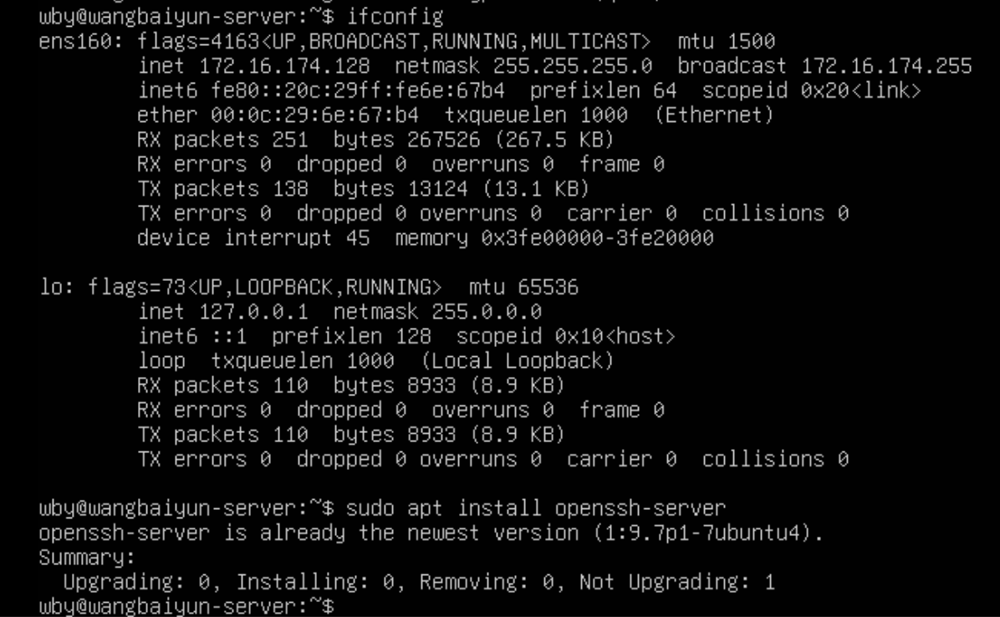

# MAC
最好在Linux系统中进行安装，在Mac中需要安装一个虚拟机
## VMware Fusion
## Ubuntu
### 电脑远程连接控制：ssh
在系统中输入
```
ifconfig
```

得到`ens160->inet`的端口号，在mac中打开终端，输入
```
ssh wby@172.16.174.128
```
密码为Ubuntu中用户密码，建立连接
```
(base) nancywang@xxs-book ~ % ssh wby@172.16.174.128
wby@172.16.174.128's password:
Welcome to Ubuntu 24.10 (GNU/Linux 6.11.0-8-generic aarch64)

 * Documentation:  https://help.ubuntu.com
 * Management:     https://landscape.canonical.com
 * Support:        https://ubuntu.com/pro

 System information as of Mon Oct 21 02:33:28 PM UTC 2024

  System load:  0.0               Temperature:             11758.9 C
  Usage of /:   24.8% of 9.75GB   Processes:               245
  Memory usage: 7%                Users logged in:         0
  Swap usage:   0%                IPv4 address for ens160: 172.16.174.128


1 update can be applied immediately.
To see these additional updates run: apt list --upgradable
```
## 克隆仓库
```
git clone https://github.com/tianocore/edk2.git
cd edk2
git submodule update --init
sudo apt install bison
sudo apt install iasl
sudo apt install uuid-dev
sudo apt install python3
sudo ln -s /usr/bin/python3 /usr/bin/python
sudo apt install alien
sudo wget https://www.nasm.us/pub/nasm/releasebuilds/2.16.03/linux/nasm-2.16.03-0.fc39.x86_64.rpm # 在当前目录下下载nasm

source edksetup.sh
make -C BaseTools //只需要执行一次即可，首次编译
build -a AARCH64 -t GCC5 -p ArmVirtPkg/ArmVirtQemu.dsc -b DEBUG
sudo apt install xorg # 在ubuntu上安装
```
成功显示：
```
Fd File Name:QEMU_EFI (/home/wby/edk2/Build/ArmVirtQemu-AARCH64/DEBUG_GCC5/FV/QEMU_EFI.fd)

Generate Region at Offset 0x0
   Region Size = 0x1000
   Region Name = DATA

Generate Region at Offset 0x1000
   Region Size = 0x1FF000
   Region Name = FV

Generating FVMAIN_COMPACT FV

Generating FVMAIN FV
#######
Fd File Name:QEMU_VARS (/home/wby/edk2/Build/ArmVirtQemu-AARCH64/DEBUG_GCC5/FV/QEMU_VARS.fd)

Generate Region at Offset 0x0
   Region Size = 0x40000
   Region Name = DATA

Generate Region at Offset 0x40000
   Region Size = 0x40000
   Region Name = DATA

Generate Region at Offset 0x80000
   Region Size = 0x40000
   Region Name = None

GUID cross reference file can be found at /home/wby/edk2/Build/ArmVirtQemu-AARCH64/DEBUG_GCC5/FV/Guid.xref

FV Space Information
FVMAIN [99%Full] 6545408 (0x63e000) total, 6545368 (0x63dfd8) used, 40 (0x28) free
FVMAIN_COMPACT [55%Full] 2093056 (0x1ff000) total, 1152352 (0x119560) used, 940704 (0xe5aa0) free

- Done -
```
编写sh文件用于配置环境：
```
export WORKSPACE=$PWD
export PACKAGES_PATH=/home/wby/edk2
export IASL_PREFIX=/home/wby/acpica/generate/unix/bin/
export PYTHON_COMMAND=/usr/bin/python3
export GCC5=/usr/bin/gcc
```
## 磁盘扩容

在使用的过程中，经常会出现磁盘满了的情况。此时需要在VMWare中进行磁盘扩容。但是仅在这里扩大磁盘是不够的，需要在虚拟机中进行扩容，而且如果已经满盘了，可能会在启动时卡死在Cloud-init步骤，这时候要进终端进行操作
- 虚拟机启动时进入终端方法：
```
Ctrl+alt+F2
```
用ssh远程连接电脑也可行
- 先解决启动的问题
```
# 查看是否有可用空间
df -h
sudo vgdisplay
lsblk
# 重新分配磁盘空间
sudo lvextend -L +20G /dev/mapper/ubuntu--vg-ubuntu--lv
sudo resize2fs /dev/mapper/ubuntu--vg-ubuntu--lv
```

### 问题
1、
```
/bin/sh: 1: /home/wby/edk2/acpica/generate/unix/bin/iasl: not found
make:
```
原因：iasl的路径问题，需要重新设置IASL_PREFIX的路径为/home/wby/acpica/generate/unix/bin/

# Windwos --SUCCESS
按照[[ UEFI开发 ] Linux 环境 ( Ubuntu ) 部署 EDK2 开发环境](https://blog.csdn.net/weixin_44139099/article/details/140681442)的操作进行，基本会成功，注意里边有一个地方不需要cd。

# ECC
<https://github.com/tianocore/tianocore.github.io/wiki/ECC-tool>
这个工具可以帮助检测编码的样式问题
